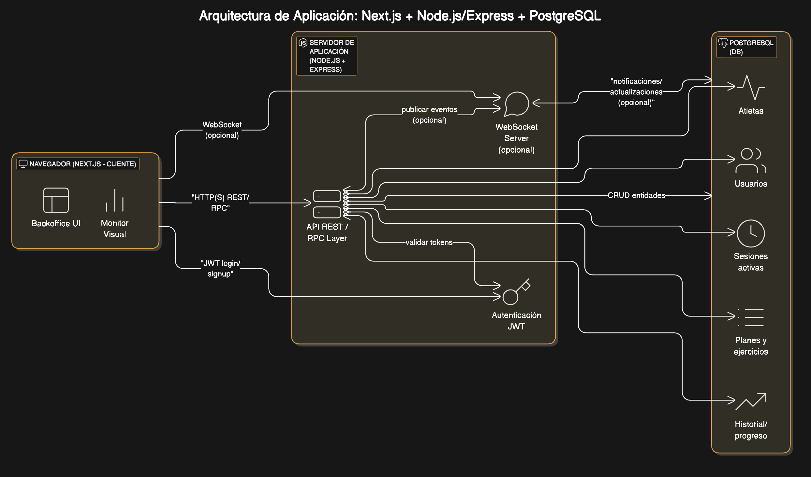
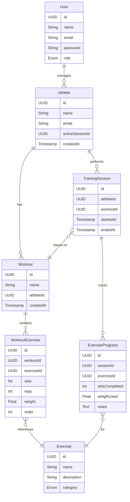
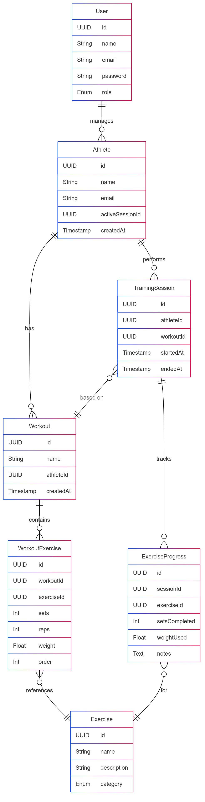

## Índice

0. [Ficha del proyecto](#0-ficha-del-proyecto)
1. [Descripción general del producto](#1-descripción-general-del-producto)
2. [Arquitectura del sistema](#2-arquitectura-del-sistema)
3. [Modelo de datos](#3-modelo-de-datos)
4. [Especificación de la API](#4-especificación-de-la-api)
5. [Historias de usuario](#5-historias-de-usuario)
6. [Tickets de trabajo](#6-tickets-de-trabajo)
7. [Pull requests](#7-pull-requests)
7. [Pull requests](#7-pull-requests)
8. [Extra - Sprint planning](#8-extra---sprint-planning)

---

## 0. Ficha del proyecto

### **0.1. Tu nombre completo:**

Esteban Platero Horcajadas

### **0.2. Nombre del proyecto:**

GymFlow (Gym Room Manager)

### **0.3. Descripción breve del proyecto:**

Se trata de una aplicación en tiempo real para gimnasios, diseñada para gestionar y visualizar qué atletas están entrenando en la sala en un momento dado. Al ingresar, cada atleta recibe automáticamente su plan de entrenamiento personalizado, incluyendo ejercicios, pesos y repeticiones. El gestor de la sala puede añadir o retirar atletas manualmente, mientras que un monitor central muestra en vivo el estado y progreso de cada sesión. El sistema mejora la organización del gimnasio, optimiza el control del entrenamiento y proporciona una experiencia más estructurada tanto para atletas como para entrenadores.

### **0.4. URL del proyecto:**

https://

> Puede ser pública o privada, en cuyo caso deberás compartir los accesos de manera segura. Puedes enviarlos a [alvaro@lidr.co](mailto:alvaro@lidr.co) usando algún servicio como [onetimesecret](https://onetimesecret.com/).

### 0.5. URL o archivo comprimido del repositorio

https://github.com/estpla/finalproject-EPH

---

## 1. Descripción general del producto

### **1.1. Objetivo:**

El objetivo del sistema es optimizar la gestión de entrenamientos en tiempo real dentro de salas de gimnasio o centros deportivos. Proporciona una herramienta centralizada que permite a los gestores controlar quiénes están presentes en la sala, qué rutina debe seguir cada atleta, y cómo evoluciona su entrenamiento durante la sesión.

* Qué valor aporta:
    - Mejora la organización y visibilidad en la sala de entrenamiento.
    - Automatiza la entrega de planes personalizados sin intervención manual del entrenador.
    - Aumenta el control y seguimiento del rendimiento de los atletas.
    - Facilita la coordinación entre gestores, entrenadores y atletas mediante una única plataforma visual y operativa.
    - Motiva al atleta al mostrar su progreso de forma clara y en tiempo real.

* Qué soluciona:
    - Falta de visibilidad sobre quién está entrenando y en qué etapa.
    - Gestión manual e informal de rutinas de entrenamiento.
    - Dificultades para seguir el progreso o cumplimiento del plan durante la sesión.
    - Necesidad de supervisión constante por parte del entrenador.

* Para quién:
    - Gestores de sala o responsables operativos en centros deportivos.
    - Entrenadores y preparadores físicos que diseñan y asignan rutinas.
    - Atletas que siguen planes personalizados de entrenamiento.
    - Centros deportivos que buscan profesionalizar la experiencia en sala.

### **1.2. Características y funcionalidades principales:**

1. Gestión en tiempo real de atletas activos
    - Añadir o quitar atletas que se encuentran entrenando en la sala.
    - Visualización inmediata del estado de cada atleta en la plataforma.
2. Asignación automática del plan de entrenamiento
    - Al ingresar, el atleta accede automáticamente a su rutina personalizada.
    - Rutinas con ejercicios detallados: series, repeticiones, peso, descanso.
3. Visualización en monitor de sala
    - Pantalla principal donde se muestra el estado de todos los atletas activos.
    - Interfaz clara y dinámica, pensada para monitores o televisores.
4. Progreso de sesión en tiempo real
    - El atleta marca el avance de sus ejercicios desde su dispositivo o terminal.
    - Indicadores visuales de progreso para motivación y control.
5. Editor de planes de entrenamiento
    - Herramienta para que los entrenadores diseñen rutinas.
    - Posibilidad de crear, modificar y asignar planes a distintos perfiles.
6. Historial de entrenamiento
    - Registro automático de cada sesión realizada por el atleta.
    - Permite análisis de consistencia, cumplimiento y evolución física.
7. Roles de usuario y permisos
    - Diferenciación entre gestores, entrenadores y atletas.
    - Control de acceso a funcionalidades según rol.
8. Diseño adaptable y visualmente optimizado
    - Interfaces pensadas para pantallas grandes, tablets y dispositivos móviles.
    - Uso de colores e iconografía clara para facilitar la comprensión.

### **1.3. Diseño y experiencia de usuario:**

> Proporciona imágenes y/o videotutorial mostrando la experiencia del usuario desde que aterriza en la aplicación, pasando por todas las funcionalidades principales.

### **1.4. Instrucciones de instalación:**

> Documenta de manera precisa las instrucciones para instalar y poner en marcha el proyecto en local (librerías, backend, frontend, servidor, base de datos, migraciones y semillas de datos, etc.)

---

## 2. Arquitectura del Sistema

### **2.1. Diagrama de arquitectura:**

1. Arquitectura elegida

🧠 Cliente-Servidor: Evaluación de la Arquitectura

✅ Por qué es una buena elección para este proyecto
1. Separación de responsabilidades clara
    - El cliente se encarga de la experiencia de usuario.
    - El servidor gestiona lógica, datos, reglas de negocio.
2. Escalabilidad razonable
    - Puedes escalar el frontend y backend por separado si es necesario.
    - Puedes mover el backend a un microservicio en el futuro.
3. Tecnologías populares y maduras
    - Node.js, Next.js, PostgreSQL y Prisma tienen comunidades amplias, documentación sólida y fácil hosting.
4. Adaptado para MVPs
    - Suficiente simplicidad para entregar rápido sin sacrificar arquitectura limpia.
5. Buen soporte para tiempo real
    - Con WebSockets (socket.io), puedes lograr una interfaz viva sin complejidad extrema.

❌ Sacrificios y déficits
1. Mayor complejidad que un stack monolítico full-stack simple
    - Separar backend y frontend implica gestión de CORS, tokens, sesiones, etc.
2. Latencia entre cliente y servidor
    - Cualquier interacción (aunque sea ligera) requiere viaje a servidor. Para tiempo real, hay que optimizar esto (usando WebSockets o suscripciones).
3. Gestión de estado duplicado (cliente-servidor)
    - Si el estado no se sincroniza bien, puede haber errores de UX. Esto requiere buena arquitectura de frontend (React context, swr, tanstack-query).
4. Despliegue en múltiples entornos
    - Necesitas coordinar despliegue del frontend (Vercel, por ejemplo) y backend (Render, Railway, etc.).

🏁 Resumen
✅ Es una buena elección porque: es modular, escalable, extensible y va bien con tu stack y necesidades (tiempo real, gestión, visualización).
⚠️ Los desafíos están en la sincronización de estado, el despliegue y el tiempo real, pero son abordables y no excesivos para un MVP.

2. C4 - Nivel 1: Diagrama de Contexto

```
[Usuario: Gestor/Entrenador] --> (Aplicación Web - Backoffice)
[Usuario: Atleta] --> (Pantalla de Visualización / Terminal de Progreso)

(Aplicación Web) --> (API REST/Express)
(API REST) --> (Base de Datos PostgreSQL)
```

3. C4 - Nivel 2: Diagrama de Contenedores

```
+----------------------------+         
|        Navegador          |         
|  (Next.js - Cliente)      |         
|  - Backoffice UI          |         
|  - Monitor Visual         |         
+------------+--------------+         
             |                         
             v                         
+------------+--------------+         
|   Servidor de Aplicación  |         
|    Node.js + Express      |         
|  - API REST / RPC Layer   |         
|  - WebSocket Server (op.) |         
|  - Autenticación JWT      |         
+------------+--------------+         
             |                         
             v                         
+------------+--------------+         
|      PostgreSQL (DB)      |         
| - Usuarios                |         
| - Atletas                 |         
| - Planes y ejercicios     |         
| - Sesiones activas        |         
| - Historial/progreso      |         
+---------------------------+         
```



### **2.2. Descripción de componentes principales:**

🧱 Arquitectura Cliente-Servidor para MVP
🔧 Tecnologías
- Backend: Node.js + Express, PostgreSQL, Prisma (ORM)
- Frontend: Next.js + React, Shadcn/UI, TailwindCSS

📐 Componentes arquitectónicos necesarios
1. Cliente (Frontend)
Separado en dos interfaces:
🖥️ 1.1. Monitor de Sala (Pantalla de Visualización en Tiempo Real)
- Aplicación Next.js sin login, modo "pantalla completa".
- Suscripción o polling para recibir datos actualizados de atletas y progreso.
- Auto-refresh o WebSocket para mostrar cambios en tiempo real.
- Layout adaptado a TV/monitor con rotulación clara.

🧑‍💼 1.2. Backoffice (Gestión de Atletas y Planes)
- Aplicación Next.js con login (gestor/entrenador).
- Interfaz para:
    - Añadir/quitar atletas de la sala.
    - Crear/asignar planes de entrenamiento.
    - Ver historial.
Requiere protección de rutas (middleware) y panel de control tipo dashboard.

2. Servidor (Backend - API REST o RPC)
Usando Node.js + Express + Prisma + PostgreSQL.
2.1. API Layer
- Rutas REST o API Routes en Next.js (si quieres minimizar Express).
- Endpoints principales:
    - /athletes/active: obtener atletas activos.
    - /session/start, /session/end: controlar presencia.
    - /workouts/{id}: obtener detalles de rutina.
    - /progress: guardar progreso.
    - /plans: CRUD de planes de entrenamiento.
- Protecciones por rol (middleware de autenticación/autorización).

2.2. Realtime Layer (opcional para MVP)
- Opción 1: Polling simple desde frontend (cada X segundos).
- Opción 2 (mejor UX): WebSocket con socket.io para emitir cambios a la sala.

2.3. ORM / Base de Datos
- Prisma conectado a PostgreSQL.
- Migraciones y seed para datos iniciales.
- Relaciones básicas:
    - User (gestores, entrenadores)
    - Athlete
    - Plan ➝ con lista de Exercise
    - Session ➝ atleta activo en sala
    - Progress (registro por ejercicio)

3. Base de Datos (PostgreSQL)
- Relacional y bien adaptada a planes y seguimiento.
- Tablas principales:
    - users, athletes, plans, exercises, sessions, progress_logs
- Prisma se encarga del acceso y mantenimiento del esquema.

4. Autenticación
- JWT (con almacenamiento en cookies seguras) o next-auth para facilidad.
- Roles definidos en el token: admin, coach, monitor.

5. Deploy / Hosting
- Frontend: Vercel (ideal para Next.js).
- Backend + DB: Railway, Render, Supabase o incluso Vercel API routes si quieres un stack simplificado.
- PostgreSQL: Supabase, Neon o Railway DB para MVP.

🔁 Resumen del Flujo
1. El gestor inicia sesión desde el backoffice (Next.js).
2. Añade atletas a la sala ➝ Se crea sesión activa en backend.
3. El monitor de sala recibe (por polling o WebSocket) el estado actualizado.
4. El atleta ve su rutina y marca progreso (vía terminal o backend).
5. Al terminar, se cierra la sesión ➝ queda registrada en el historial.

### **2.3. Descripción de alto nivel del proyecto y estructura de ficheros**

🏗️ Descripción General:
GymFlow es una plataforma cliente-servidor para la gestión en tiempo real de atletas dentro de una sala de entrenamiento. Ofrece una vista operativa clara de quiénes están activos, qué ejercicios deben realizar y cómo progresa cada sesión. Incluye una interfaz pública para mostrar en monitores y un panel de gestión privado para entrenadores y gestores.

🎯 Objetivos Clave:
- Gestionar atletas activos en la sala.
- Asignar y visualizar rutinas personalizadas.
- Mostrar el estado de la sala en tiempo real.
- Permitir al gestor controlar los flujos de entrenamiento desde un backoffice.

🧰 Stack Tecnológico:
- Frontend: React + Next.js, Shadcn, TailwindCSS
- Backend: Node.js + Express
- ORM: Prisma
- DB: PostgreSQL
- Autenticación: JWT (o NextAuth si se quiere integrar fácilmente en Next.js)
- Realtime: WebSocket (con Socket.io o alternativa)
- Deploy: Vercel (frontend), Railway/Render (backend), Supabase/Neon (DB)

```
/frontend
├── public/                  # Imágenes, íconos, logos
├── src/
│   ├── app/                 # Rutas de Next.js (App Router)
│   │   ├── dashboard/       # Backoffice para gestión
│   │   ├── monitor/         # Vista de sala para TV/monitor
│   │   ├── api/             # Endpoints si se decide usar API Routes
│   │   └── page.tsx         # Página principal o login
│   ├── components/          # Componentes UI reutilizables
│   ├── features/            # Módulos separados por dominio (e.g. athletes, sessions)
│   ├── hooks/               # React hooks personalizados
│   ├── lib/                 # Funciones utilitarias, conexión API, auth
│   ├── styles/              # Archivos de estilos (Tailwind config)
│   └── config/              # Configuración de roles, rutas protegidas, etc.
├── .env.local
├── tailwind.config.js
└── next.config.js
```

```
/backend
├── src/
│   ├── controllers/         # Lógica de negocio (e.g. sessionController.js)
│   ├── routes/              # Rutas Express (e.g. /sessions, /athletes)
│   ├── services/            # Lógica de dominio (e.g. workout assignment)
│   ├── middlewares/         # Auth, errores, validaciones
│   ├── sockets/             # Configuración WebSocket (e.g. socket.io)
│   ├── utils/               # Funciones auxiliares (fechas, tokens, etc.)
│   ├── prisma/              # Esquema y cliente de Prisma
│   │   ├── schema.prisma
│   │   └── seed.ts
│   ├── index.ts             # Punto de entrada principal del servidor
│   └── server.ts            # Setup de Express, middleware, rutas
├── .env
├── tsconfig.json
└── package.json
```

🔐 Autenticación y Roles
- Los roles (admin, coach, viewer) se pueden manejar con un middleware en el backend y validaciones en el frontend.
- Usar JWT o NextAuth según preferencia: JWT te da más control, NextAuth más rapidez de implementación.

🧪 Extensiones Opcionales a futuro
- /mobile: carpeta para una app móvil (React Native o Expo).
- /admin: consola administrativa más avanzada si hay múltiples centros.
- /docs: documentación técnica y funcional del sistema (puede incluir Swagger para API).

### **2.4. Infraestructura y despliegue**

🌐 Infraestructura con Render + Supabase (para MVP)
🧱 Componentes Principales
1. Frontend – App Next.js (React + Tailwind + Shadcn)
    - Desplegado en Render como Web Service estático.
    - Se comunica con el backend a través de HTTP(S).
2. Backend – API Node.js + Express + Prisma
    - Desplegado en Render como Web Service dinámico.
    - Expone endpoints REST o API para el frontend.
    - Opcionalmente usa WebSocket para tiempo real.
3. Base de Datos – PostgreSQL en Supabase
    - Administra usuarios, atletas, planes, sesiones, progreso, etc.
    - Prisma se conecta directamente a Supabase desde el backend.
4. Autenticación (opcional) – Puede usarse Supabase Auth o JWT.
    - Si usas Supabase Auth: se conecta vía SDK.
    - Si usas JWT: el backend genera/verifica los tokens.

🗺️ Diagrama de Infraestructura (Render + Supabase)

                                 ┌──────────────────────────────┐
                                 │         Usuarios             │
                                 │ (Gestores / Monitores / TVs) │
                                 └────────────┬─────────────────┘
                                              │
                     ┌────────────────────────▼─────────────────────────┐
                     │                Render (Frontend)                │
                     │         Next.js (Monitor + Backoffice)          │
                     └────────────────┬────────────────────────────────┘
                                      │ API HTTP calls / WebSocket
                     ┌────────────────▼────────────────────────────────┐
                     │                 Render (Backend)                │
                     │         Node.js + Express + Prisma              │
                     │       API REST / WS / Auth middleware           │
                     └────────────────┬────────────────────────────────┘
                                      │ Prisma connection
                     ┌────────────────▼──────────────────┐
                     │         Supabase (PostgreSQL)     │
                     │ - Athletes, Plans, Sessions, Logs │
                     └───────────────────────────────────┘

🚀 Proceso de Despliegue
🧩 1. Preparación del Proyecto
    - El proyecto está dividido en dos carpetas:
        - /frontend: aplicación Next.js
        - /backend: aplicación Express + Prisma
🛠️ 2. Desplegar la Base de Datos (Supabase)
    - Crear un proyecto en Supabase.
    - Crear base de datos PostgreSQL.
    - Copiar la connection string para usarla en .env del backend.
    - Opcional: definir autenticación, roles, restricciones.
☁️ 3. Desplegar Backend en Render
    - Ir a https://render.com.
    - Crear un Web Service nuevo con el repositorio /backend.
    - Variables de entorno necesarias:
        - DATABASE_URL → desde Supabase
        - PORT → usualmente 10000 o definido por Render
        - JWT_SECRET, etc.
    - Activar "auto deploy" desde GitHub (opcional).
    - Asegurarse de que escucha en process.env.PORT.
🌍 4. Desplegar Frontend en Render
    - Crear otro Web Service o Static Site para /frontend.
        - Si usas next export: Static Site.
        - Si usas SSR (getServerSideProps): Web Service (Node).
    - Variables de entorno:
        - NEXT_PUBLIC_API_URL → URL del backend desplegado
        - NEXT_PUBLIC_WS_URL → si usas WebSocket
    - Configurar el build command: npm run build
    - Output dir: .next o out si haces export.

✅ Resumen de Beneficios
- Render: hosting sencillo, integración con GitHub, soporte para Node y WebSocket.
- Supabase: DB potente, con panel amigable, backups y auth opcional.
- Separación de responsabilidades: backend flexible y frontend optimizado.

### **2.5. Seguridad**

> Enumera y describe las prácticas de seguridad principales que se han implementado en el proyecto, añadiendo ejemplos si procede

🛡️ 1. Autenticación y Autorización Segura
✅ Prácticas:
- Usar tokens JWT con expiración corta (ej. 15–60 min).
- Almacenar tokens en httpOnly cookies (mejor que en localStorage).
- Control de acceso por roles (ej. admin, coach, viewer).
- Validar el rol en cada endpoint backend.
🧠 Ejemplo:
```ts
// Express middleware
const requireAuth = (role: 'admin' | 'coach') => (req, res, next) => {
  const token = req.cookies.token;
  const user = jwt.verify(token, process.env.JWT_SECRET);
  if (!user || user.role !== role) return res.status(403).send('Forbidden');
  req.user = user;
  next();
};
```

🔒 2. Seguridad en la Base de Datos
✅ Prácticas:
- Usar un ORM seguro como Prisma (evita SQL Injection).
- Limitar privilegios del usuario de la base de datos.
- Escapar siempre inputs antes de hacer queries manuales.
- Uso de migraciones para cambios controlados.
🧠 Ejemplo:
```ts
// Evita interpolar manualmente inputs
await prisma.user.findFirst({ where: { email: input.email } });
```

🌐 3. Seguridad Web (Frontend y API)
✅ Prácticas:
- CORS configurado explícitamente para solo permitir dominios confiables.
- Rate limiting en rutas críticas (login, sesiones).
- CSRF protection si usas cookies.
- Validar el tipo de contenido recibido en el backend.

🧠 Ejemplo (CORS en Express):
```ts
app.use(cors({
  origin: ['https://tuapp.com'],
  credentials: true,
}));
```

🧾 4. Validación de Datos de Entrada
✅ Prácticas:
- Usar una librería de validación como zod, joi o express-validator.
- Validar siempre antes de procesar o almacenar datos.
- Nunca confiar en datos del cliente.

🧠 Ejemplo:
```ts
const schema = z.object({
  email: z.string().email(),
  weight: z.number().min(1),
});
schema.parse(req.body); // Lanzará excepción si no cumple
```

🔐 5. Almacenamiento Seguro de Credenciales y Tokens
✅ Prácticas:
- Usar variables de entorno (.env) y nunca subirlas a git.
- Usar dotenv o configuración de Render/Supabase para secrets.
- Rotar secretos si hay filtración.

🧠 Ejemplo:
```ts
const token = jwt.sign({ userId: user.id }, process.env.JWT_SECRET, { expiresIn: '30m' });
```

🕵️ 6. Logs y Monitoreo de Actividad
✅ Prácticas:
- Registrar logins, accesos y errores con IP, userId y timestamps.
- No guardar contraseñas, tokens o datos sensibles en logs.
- Usar herramientas como Sentry, LogRocket, Logtail, etc.

🧠 Ejemplo:
```ts
logger.info(`Login attempt for ${email} from IP ${req.ip}`);
```

📦 7. Dependencias y Paquetes Seguros
✅ Prácticas:
- Revisar dependencias con npm audit o snyk.
- No instalar paquetes sin reputación o sin revisión.
- Actualizar regularmente (npm update).

📱 8. Protección en Realtime (WebSocket)
✅ Prácticas:
- Autenticar al usuario al abrir el socket (ej. enviar token).
- Filtrar eventos por rol (ej. un viewer no puede emitir eventos).
- Cerrar sockets inactivos o con actividad sospechosa.

🧠 Ejemplo:
```ts
io.use((socket, next) => {
  const token = socket.handshake.auth.token;
  const user = jwt.verify(token, JWT_SECRET);
  if (!user) return next(new Error('Unauthorized'));
  socket.user = user;
  next();
});
```

🧯 9. Backups y Recuperación
✅ Prácticas:
- Usar los backups automáticos de Supabase (plan pago si es crítico).
- Exportar la base de datos semanalmente como medida adicional.

✉️ 10. Prevención de Fugas de Información
✅ Prácticas:
- No exponer detalles técnicos en errores (stack traces, DB errors).
- Usar mensajes genéricos para errores de login o permisos.
- Desactivar cabeceras innecesarias (ej. X-Powered-By en Express).

### **2.6. Tests**

🧪 1. Tests de Backend (Node.js + Express + Prisma)
✅ 1.1. Tests Unitarios
Qué probar: Funciones puras, validaciones, lógica de negocio independiente (por ejemplo, cálculo de progresos, verificación de rol).

Motivo:
- Detectan errores en la lógica sin depender de la base de datos o la red.
- Son rápidos de ejecutar y dan feedback inmediato.

Ejemplo:
- Función que calcula si un atleta ha completado una serie según su plan.
- Middleware de autenticación o autorización.

✅ 1.2. Tests de Integración
Qué probar: Interacción entre controladores, base de datos y servicios externos.

Motivo:
- Verifica que Prisma, Express y Supabase estén integrados correctamente.
- Asegura que las operaciones CRUD funcionan como se espera.

Ejemplo:
- Endpoint POST /sessions/start crea correctamente una sesión y relaciona al atleta.
- GET /workouts/:athleteId devuelve los ejercicios adecuados.

Herramientas sugeridas: Jest, Supertest, Prisma Test Utils, sqlite in-memory o base temporal.

🧩 2. Tests de Frontend (React + Next.js)
✅ 2.1. Tests de Componentes (Unitarios)
Qué probar: Componentes individuales (ej. cards, botones, formularios).

Motivo:
- Aseguran que cada componente renderiza correctamente bajo diferentes props y estados.
- Detectan errores de UI tempranos.

Ejemplo:
- Componente WorkoutCard que muestra series, repeticiones y carga.
- UserList con props como lista vacía o cargando.

Herramientas sugeridas: React Testing Library, Jest.

✅ 2.2. Tests de Integración de UI
Qué probar: Flujo entre varios componentes + estado.

Motivo:
- Verifica que interacciones del usuario actualicen la UI correctamente (sin llegar a ser tests end-to-end).
- Útiles para la parte del monitor de sala y gestión de atletas.

Ejemplo:
- Hacer click en un atleta lo muestra en pantalla con sus ejercicios.
- Añadir un ejercicio en el backoffice lo refleja en pantalla.

🌍 3. Tests End-to-End (E2E)
✅ 3.1. Tests de Flujo Completo
Qué probar: Flujos reales del usuario con navegador simulado.

Motivo:
- Aseguran que todo el stack (frontend + backend + base de datos) funciona integrado.
- Críticos para tareas clave como:
    - Iniciar una sesión de entrenamiento.
    - Actualizar el progreso de un ejercicio.
    - Añadir un nuevo atleta desde el backoffice.

Herramientas sugeridas: Cypress, Playwright.

⚙️ 4. Tests de API (opcionales si tienes E2E + integración)
Qué probar: Comportamiento de los endpoints HTTP.

Motivo:
- Útiles para documentar y validar la API si otros sistemas van a consumirla.
- También ayudan si decides usar Swagger/OpenAPI.

Herramientas: Supertest, Insomnia, Postman (Tests), Pact si usas contratos.

🧰 Resumen: Tipos de Tests Recomendados por Prioridad

| Tipo de Test        | Área      | Herramientas sugeridas | Prioridad |
| ------------------- | --------- | ---------------------- | --------- |
| Unitarios           | Backend   | Jest                   | 🟢 Alta   |
| Integración Backend | Backend   | Supertest, Prisma      | 🟢 Alta   |
| Unitarios de UI     | Frontend  | React Testing Library  | 🟡 Media  |
| Integración de UI   | Frontend  | React Testing Library  | 🟢 Alta   |
| End-to-End          | Fullstack | Cypress / Playwright   | 🟢 Alta   |
| API Tests (REST)    | Backend   | Supertest / Postman    | ⚪️ Baja   |

---

## 3. Modelo de Datos

### **3.1. Diagrama del modelo de datos:**





### **3.2. Descripción de entidades principales:**

🧩 Entidades Principales del Sistema
1. Atleta (Athlete)
Representa a un usuario que realiza entrenamientos en la sala.
| Campo             | Tipo      | Descripción                                |
| ----------------- | --------- | ------------------------------------------ |
| `id`              | UUID      | Identificador único                        |
| `name`            | String    | Nombre completo del atleta                 |
| `email`           | String    | Correo (opcional o para notificaciones)    |
| `activeSessionId` | UUID?     | Sesión activa actual en la sala (nullable) |
| `createdAt`       | Timestamp | Fecha de registro                          |


🔗 Relaciones:
- Tiene muchas sesiones de entrenamiento (TrainingSession)
- Puede estar activo en la sala si tiene activeSessionId

2. Ejercicio (Exercise)
Define un tipo de ejercicio disponible (p. ej., "Press Banca").
| Campo         | Tipo   | Descripción                        |
| ------------- | ------ | ---------------------------------- |
| `id`          | UUID   | Identificador                      |
| `name`        | String | Nombre del ejercicio               |
| `description` | Text   | (opcional) descripción técnica     |
| `category`    | Enum   | `upper_body`, `legs`, `core`, etc. |

🔗 Relaciones:
Utilizado dentro de Workout como parte de una sesión

3. Plan de Entrenamiento (Workout)
Plantilla con ejercicios que debe realizar un atleta en una sesión.
| Campo       | Tipo      | Descripción                      |
| ----------- | --------- | -------------------------------- |
| `id`        | UUID      | Identificador                    |
| `name`      | String    | Nombre del plan (p.ej., “Día A”) |
| `athleteId` | UUID      | A quién va dirigido              |
| `createdAt` | Timestamp | Fecha de creación                |

🔗 Relaciones:
- Tiene muchos WorkoutExercise (ejercicios con series y repeticiones)

4. Ejercicio dentro de un Workout (WorkoutExercise)
Contiene la configuración de un ejercicio en un plan.
| Campo        | Tipo  | Descripción           |
| ------------ | ----- | --------------------- |
| `id`         | UUID  | ID interno            |
| `workoutId`  | UUID  | Plan al que pertenece |
| `exerciseId` | UUID  | Tipo de ejercicio     |
| `sets`       | Int   | Series                |
| `reps`       | Int   | Repeticiones          |
| `weight`     | Float | Peso sugerido (kg)    |
| `order`      | Int   | Orden de ejecución    |


5. Sesión Activa (TrainingSession)
Representa la entrada real de un atleta a la sala para ejecutar un plan.
| Campo       | Tipo      | Descripción                             |
| ----------- | --------- | --------------------------------------- |
| `id`        | UUID      | ID único                                |
| `athleteId` | UUID      | Quién la está ejecutando                |
| `workoutId` | UUID      | Plan asignado                           |
| `startedAt` | Timestamp | Inicio de sesión                        |
| `endedAt`   | Timestamp | Fin de sesión (nullable si está activa) |

🔗 Relaciones:
- Cada sesión tiene muchos ExerciseProgress

6. Progreso de Ejercicio (ExerciseProgress)
Representa el estado actual de ejecución por ejercicio dentro de una sesión.
| Campo           | Tipo  | Descripción                  |
| --------------- | ----- | ---------------------------- |
| `id`            | UUID  | ID                           |
| `sessionId`     | UUID  | A qué sesión pertenece       |
| `exerciseId`    | UUID  | Qué ejercicio                |
| `setsCompleted` | Int   | Cuántas series ha completado |
| `weightUsed`    | Float | Peso realmente usado         |
| `notes`         | Text  | Observaciones opcionales     |

7. Usuario de Gestión (User)
Representa a los gestores de la sala (admin, entrenador, etc.).
| Campo      | Tipo   | Descripción         |
| ---------- | ------ | ------------------- |
| `id`       | UUID   | Identificador       |
| `name`     | String | Nombre del usuario  |
| `email`    | String | Correo (para login) |
| `role`     | Enum   | `admin`, `coach`    |
| `password` | String | Hash de contraseña  |

🔗 Relaciones Principales (Resumen Visual)
```md
User ────────────┐
                 └─> gestiona ──> Athlete
Athlete ─────────┬─> tiene ──> Workout
                 └─> realiza ──> TrainingSession ──> ExerciseProgress
Workout ─────────└─> compuesto por ──> WorkoutExercise ──> Exercise
```

---

## 4. Especificación de la API

```yaml
openapi: 3.0.3
info:
  title: Gym Session API
  version: 1.0.0
  description: API para gestionar sesiones de entrenamiento en un gimnasio

paths:

  /sessions/start:
    post:
      summary: Iniciar sesión de entrenamiento para un atleta
      description: Crea una nueva sesión activa para un atleta con un plan de entrenamiento asociado.
      requestBody:
        required: true
        content:
          application/json:
            schema:
              type: object
              properties:
                athleteId:
                  type: string
                workoutId:
                  type: string
              required:
                - athleteId
                - workoutId
      responses:
        '201':
          description: Sesión creada con éxito
          content:
            application/json:
              schema:
                type: object
                properties:
                  sessionId:
                    type: string
                  startedAt:
                    type: string
                    format: date-time
                  athleteId:
                    type: string
                  workoutId:
                    type: string
        '400':
          description: Datos inválidos o atleta ya en sesión

  /room/status:
    get:
      summary: Obtener estado actual de la sala
      description: Devuelve una lista de atletas que se encuentran entrenando en este momento y sus progresos.
      responses:
        '200':
          description: Lista de atletas en sala con progreso actual
          content:
            application/json:
              schema:
                type: array
                items:
                  type: object
                  properties:
                    athleteId:
                      type: string
                    name:
                      type: string
                    workoutName:
                      type: string
                    currentExercise:
                      type: string
                    setsCompleted:
                      type: integer
                    totalSets:
                      type: integer

  /progress/{sessionId}/{exerciseId}:
    patch:
      summary: Actualizar progreso de un ejercicio
      description: Permite actualizar las series completadas y el peso usado para un ejercicio dentro de una sesión.
      parameters:
        - in: path
          name: sessionId
          required: true
          schema:
            type: string
        - in: path
          name: exerciseId
          required: true
          schema:
            type: string
      requestBody:
        required: true
        content:
          application/json:
            schema:
              type: object
              properties:
                setsCompleted:
                  type: integer
                weightUsed:
                  type: number
                notes:
                  type: string
      responses:
        '200':
          description: Progreso actualizado correctamente
          content:
            application/json:
              schema:
                type: object
                properties:
                  status:
                    type: string
                  updatedAt:
                    type: string
                    format: date-time
        '404':
          description: Sesión o ejercicio no encontrado
```

📦 Ejemplos de uso
1. POST /sessions/start

Request:
```json
{
  "athleteId": "uuid-atleta-123",
  "workoutId": "uuid-workout-789"
}
```

Response:
```json
{
  "sessionId": "uuid-session-456",
  "startedAt": "2025-05-14T10:12:00Z",
  "athleteId": "uuid-atleta-123",
  "workoutId": "uuid-workout-789"
}
```

2. GET /room/status

Response:
```json
[
  {
    "athleteId": "uuid-1",
    "name": "María Torres",
    "workoutName": "Día A - Fuerza",
    "currentExercise": "Press de Banca",
    "setsCompleted": 2,
    "totalSets": 4
  },
  {
    "athleteId": "uuid-2",
    "name": "Carlos López",
    "workoutName": "Pierna explosiva",
    "currentExercise": "Sentadilla",
    "setsCompleted": 3,
    "totalSets": 5
  }
]
```

3. PATCH /progress/{sessionId}/{exerciseId}

Request:
```json
{
  "setsCompleted": 3,
  "weightUsed": 80.5,
  "notes": "Aumentar peso la próxima sesión"
}
```

Response:
```json
{
  "status": "updated",
  "updatedAt": "2025-05-14T11:25:40Z"
}
```

---

## 5. Historias de Usuario

**Historia de Usuario 1**

# User Story Title: Iniciar una sesión de entrenamiento

1. **como atleta registrado**,
2. **quiere** iniciar una sesión de entrenamiento con su plan asignado,
3. **para que** pueda registrar su progreso y ser visible en el estado de la sala.

# Criterios de aceptación:

1. El sistema debe permitir al atleta iniciar una sesión si no tiene otra sesión activa.
2. La sesión debe estar vinculada al plan de entrenamiento seleccionado.
3. El sistema debe devolver el ID de la sesión y la hora de inicio.

# Notas adicionales:

- Si el atleta ya tiene una sesión activa, el sistema debe devolver un error claro.
- Esta funcionalidad podría iniciarse mediante una tablet, un terminal táctil o un lector de credenciales en la sala.

# Historias de usuario relacionadas:

- Obtener estado de la sala
- Actualizar progreso de ejercicios

**Historia de Usuario 2**

# User Story Title: Ver el estado actual de la sala

1. **como gestor de sala**,
2. **quiere** ver en tiempo real qué atletas están entrenando y en qué parte del plan se encuentran,
3. **para que** pueda supervisar la actividad y ayudar si es necesario.

# Criterios de aceptación:

1. El sistema debe mostrar la lista de atletas actualmente activos.
2. Debe incluir el nombre del ejercicio actual, el progreso y el nombre del plan.
3. Los datos deben actualizarse sin necesidad de recargar manualmente.

# Notas adicionales:

- Esta funcionalidad se mostrará en un monitor de la sala para todos los usuarios.
- Puede incluirse una vista simplificada tipo "pizarra" o "dashboard de sala".

# Historias de usuario relacionadas:

- Iniciar una sesión de entrenamiento
- Actualizar progreso de ejercicios

**Historia de Usuario 3**

# User Story Title: Actualizar el progreso de un ejercicio

1. **como atleta en sesión**,
2. **quiere** registrar las series completadas y el peso usado en cada ejercicio,
3. **para que** pueda llevar un control preciso de su entrenamiento.

# Criterios de aceptación:

1. El sistema debe permitir actualizar solo ejercicios dentro de sesiones activas.
2. Debe validar que los datos ingresados son consistentes (e.g., sets >= 0).
3. Debe devolver un mensaje de confirmación y la hora de la última actualización.

# Notas adicionales:

- Esto puede ser usado desde el móvil del atleta o desde una estación compartida en sala.
- Se recomienda guardar un historial para análisis posteriores.

# Historias de usuario relacionadas:

- Iniciar una sesión de entrenamiento
- Ver el estado actual de la sala

**Requisitos técnicos**

🧠 Requisitos Técnicos del Sistema
1. Backend (Node.js + Express + Prisma + PostgreSQL)
📌 Funcionalidades
- Crear sesión de entrenamiento
    - Endpoint POST /sessions/start para validar que el atleta no tiene una sesión activa.
    - Lógica para asignar un plan (Workout) a una nueva sesión (TrainingSession).
    - Registro automático de startedAt.
    - Actualización de activeSessionId en Athlete.
- Consultar estado de la sala
    - Endpoint GET /room/status que:
        - Consulta todas las sesiones activas (endedAt IS NULL).
        - Devuelve datos del atleta, plan y progreso actual.
    - Posible cache o suscripción a cambios para mejorar la latencia de actualizaciones.
- Actualizar progreso de ejercicio
    - Endpoint PATCH /progress/{sessionId}/{exerciseId}.
    - Validación de integridad:
        - Que el ejercicio pertenezca al plan de la sesión.
        - Que los sets completados y pesos sean coherentes.
    - Timestamp de última actualización (updatedAt).

🔐 Seguridad
- Middleware de autenticación para entrenadores y atletas.
- Control de acceso para evitar que un atleta modifique sesiones de otros.
- Validación de payloads para evitar entradas maliciosas.

2. Frontend (Next.js + React + Tailwind + shadcn)
📌 Funcionalidades
- Pantalla de login/identificación de atleta (opcional según uso en sala).
- Pantalla de "entrar a la sala"
    - Formulario de inicio de sesión con selección de plan.
    - Confirmación de inicio con feedback visual.
- Vista de sala (monitor de estado)
    - Componente con lista de atletas activos, ejercicio actual y sets completados.
    - Actualización periódica o mediante WebSockets / polling cada X segundos.
- Panel de actualización de ejercicio
    - Interfaz para introducir sets completados y peso usado.
    - Feedback visual al guardar (snackbar, toast, etc.).

3. Base de Datos (PostgreSQL + Prisma)
📌 Modelo de Datos
- Tablas:
    - Athlete, Workout, WorkoutExercise, TrainingSession, Exercise, ExerciseProgress
- Relaciones correctamente modeladas con claves foráneas.
- Índices para consultas frecuentes: sesiones activas, ejercicios de workout, progreso por sesión.

📌 Lógica de negocio en queries
- Filtros por sesiones activas.
- Cálculo de progreso (ejercicio actual, sets realizados vs total).
- Validaciones en cascada (p.ej. que un ejercicio exista dentro del workout).

4. Tiempo real / Sincronización (opcional en MVP pero recomendable)
- Uso de WebSockets (ej. con Socket.IO) o polling periódico (cada 5–10 seg).
- Broadcast de actualizaciones cuando un atleta actualiza su progreso.
- Canal centralizado de estado de la sala.

5. DevOps / CI-CD / Entorno
- Deploy automático (ej. GitHub Actions para Render/Supabase).
- Variables de entorno gestionadas por entorno (.env en local, secretos en Render).
- Logs de errores para backend.
- Protección de endpoints mediante tokens/API keys si se accede desde dispositivos compartidos.

✅ Resumen por Historia de Usuario
| Historia                         | Backend                | Frontend                | Base de datos                | Tiempo real                    |
| -------------------------------- | ---------------------- | ----------------------- | ---------------------------- | ------------------------------ |
| Iniciar sesión de entrenamiento  | `POST /sessions/start` | Formulario de inicio    | `TrainingSession`, `Athlete` | (opcional) emitir nueva sesión |
| Ver estado actual de la sala     | `GET /room/status`     | Monitor en sala         | Query a sesiones activas     | Recomendado para UX            |
| Actualizar progreso de ejercicio | `PATCH /progress/...`  | Formulario de sets/peso | `ExerciseProgress`           | Emitir progreso actualizado    |

---

## 6. Tickets de Trabajo

> Documenta 3 de los tickets de trabajo principales del desarrollo, uno de backend, uno de frontend, y uno de bases de datos. Da todo el detalle requerido para desarrollar la tarea de inicio a fin teniendo en cuenta las buenas prácticas al respecto. 

**Ticket 1**

🧩 Ticket 1 – Backend

1. Título claro y conciso  
Implementar endpoint para iniciar sesión de entrenamiento (`POST /sessions/start`)

2. Descripción detallada  
  - Propósito:  
    Permitir a un atleta iniciar una sesión de entrenamiento y quedar registrado como activo en la sala. Es esencial para controlar qué usuarios están entrenando y con qué plan.

  - Detalles específicos:  
    - Recibe un `athleteId` y un `workoutId`.
    - Verifica que el atleta no tenga una sesión activa.
    - Crea un nuevo registro en `TrainingSession` con `startedAt = now()`.
    - Actualiza el campo `activeSessionId` del atleta.
    - Devuelve el ID de la sesión creada y los datos del plan.

3. Criterios de aceptación  
  - Si el atleta ya tiene una sesión activa, se devuelve error 409.
  - Si el workoutId no existe, se devuelve error 404.
  - La sesión se crea correctamente y se registra en la base de datos.
  - El `activeSessionId` se actualiza correctamente.
  - La respuesta devuelve `sessionId`, `startedAt`, `workoutId` y nombre del atleta.

  - Pruebas de validación:  
    - Crear sesión para atleta válido.
    - Intentar iniciar segunda sesión activa y recibir error.
    - Revisar base de datos y confirmar inserción.

4. Prioridad  
Alta — es la acción base para que el sistema comience a registrar actividad en la sala.

5. Esfuerzo estimado  
5 puntos de historia (1 día de trabajo, incluyendo pruebas)

6. Asignar  
Backend Developer

7. Etiquetas  
`backend`, `API`, `MVP`, `alta-prioridad`, `session`, `sala`

8. Comentarios y notas  
- Considerar lógica futura para finalizar sesión automáticamente tras cierto tiempo.

9. Enlaces o referencias  
- Historia de usuario: *Iniciar una sesión de entrenamiento*
- Especificación OpenAPI

10. Historial de cambios  
- [2025-05-14] Ticket creado

**Ticket 2**

🧩 Ticket 2 – Frontend

1. Título claro y conciso  
Crear formulario de inicio de sesión de entrenamiento para atleta

2. Descripción detallada  
  - Propósito:  
    Permitir a un atleta seleccionar su nombre y plan de entrenamiento desde una interfaz web y registrar el inicio de su sesión.

  - Detalles específicos:  
    - UI: Selector de atleta, selector de workout y botón “Iniciar sesión”.
    - Llamada al endpoint `POST /sessions/start` con datos seleccionados.
    - Mostrar mensaje de éxito o error en pantalla.
    - Diseño limpio y responsive (Tailwind + shadcn).

3. Criterios de aceptación  
  - Muestra correctamente la lista de atletas y workouts.
  - Realiza la petición correctamente al backend.
  - Feedback visual ante error o éxito.
  - Botón deshabilitado mientras la petición está en curso.

  - Pruebas de validación:  
    - Seleccionar opciones y validar el formulario.
    - Simular errores de conexión o datos inválidos.
    - Validar que al iniciar sesión se redirige o se limpia el formulario.

4. Prioridad  
Alta — permite activar el flujo principal del sistema desde la UI.

5. Esfuerzo estimado  
3 puntos de historia (1 jornada de trabajo)

6. Asignar  
Frontend Developer

7. Etiquetas  
`frontend`, `formulario`, `session`, `UI`, `tailwind`, `react`

8. Comentarios y notas  
- Reutilizable luego como componente embebido en dashboard.

9. Enlaces o referencias  
- Historia de usuario: *Iniciar una sesión de entrenamiento*
- OpenAPI: `POST /sessions/start`

10. Historial de cambios  
- [2025-05-14] Ticket creado

**Ticket 3**

🧩 Ticket 3 – Base de Datos

1. Título claro y conciso  
Definir y crear tablas para atletas, workouts y sesiones

2. Descripción detallada  
  - Propósito:  
    Establecer el modelo de datos inicial que permita a la aplicación registrar atletas, entrenamientos y sesiones activas.

  - Detalles específicos:  
    - Crear modelos en Prisma:
      - `Athlete` (id, name, activeSessionId, etc.)
      - `Workout` (id, name, exercises, etc.)
      - `TrainingSession` (id, athleteId, workoutId, startedAt, endedAt)
    - Generar migración inicial.
    - Insertar datos dummy para pruebas: 3 atletas y 2 workouts.

3. Criterios de aceptación  
  - Modelos definidos correctamente en `schema.prisma`.
  - Relaciones correctamente definidas con claves foráneas.
  - Migraciones aplicadas y sin errores.
  - Datos iniciales visibles al consultar vía Prisma Studio.

  - Pruebas de validación:  
    - Ejecutar migraciones en local y en entorno de staging.
    - Verificar integridad referencial.
    - Consultar datos dummy desde el backend.

4. Prioridad  
Alta — base esencial para todas las operaciones del sistema.

5. Esfuerzo estimado  
3 puntos de historia (0.5 - 1 jornada)

6. Asignar  
Full Stack o Backend Developer

7. Etiquetas  
`database`, `prisma`, `migraciones`, `MVP`, `modelo de datos`

8. Comentarios y notas  
- Añadir `createdAt` y `updatedAt` automáticos en todos los modelos.

9. Enlaces o referencias  
- Modelo de datos acordado
- Diagrama Mermaid de relaciones

10. Historial de cambios  
- [2025-05-14] Ticket creado

---

## 7. Pull Requests

> Documenta 3 de las Pull Requests realizadas durante la ejecución del proyecto

**Pull Request 1**

**Pull Request 2**

**Pull Request 3**

---

## 8. Extra - Sprint Planning

**🔁 Sprint 1 – Fundamentos del sistema**
Objetivo: Establecer la base del sistema: modelo de datos, backend inicial, y primer flujo funcional (iniciar sesión de entrenamiento).

🔹 Backlog del Sprint
| Tarea                                                            | Estimación | Responsable |
| ---------------------------------------------------------------- | ---------- | ----------- |
| ✅ Definir y crear tablas `Athlete`, `Workout`, `TrainingSession` | 3 pts      | Backend     |
| ✅ Insertar datos dummy iniciales                                 | 1 pt       | Backend     |
| ✅ Implementar endpoint `POST /sessions/start`                    | 5 pts      | Backend     |
| ✅ Crear formulario de inicio de sesión para atletas              | 3 pts      | Frontend    |
| ✅ Conectar formulario al endpoint                                | 2 pts      | Frontend    |

🧩 Entregables
- Primer flujo funcional: atleta inicia sesión de entrenamiento.
- Datos persistidos y visibles en la base de datos.
- UI básica funcional (aunque no estilizada aún).

**🔁 Sprint 2 – Visualización y seguimiento**
Objetivo: Mostrar el estado de la sala y permitir registrar progreso.

🔹 Backlog del Sprint
| Tarea                                                                       | Estimación | Responsable |
| --------------------------------------------------------------------------- | ---------- | ----------- |
| 🔄 Implementar endpoint `GET /room/status`                                  | 4 pts      | Backend     |
| 🔄 Crear vista tipo monitor con lista de atletas activos                    | 4 pts      | Frontend    |
| 🔄 Diseñar modelo y endpoint `PATCH /progress/:sessionId/:exerciseId`       | 4 pts      | Backend     |
| 🔄 UI de progreso: formulario por ejercicio con sets, reps, peso            | 4 pts      | Frontend    |
| 🔄 Añadir relaciones `Exercise`, `WorkoutExercise`, `ExerciseProgress` a DB | 3 pts      | Backend     |


🧩 Entregables
- Estado de la sala visible en tiempo real o actualizado periódicamente.
- Registro de progreso de ejercicios desde UI.

**🔁 Sprint 3 – Mejora, seguridad y despliegue**
Objetivo: Asegurar la calidad del MVP, desplegarlo y aplicar prácticas mínimas de seguridad.

🔹 Backlog del Sprint
| Tarea                                                              | Estimación | Responsable |
| ------------------------------------------------------------------ | ---------- | ----------- |
| 🔐 Añadir validaciones y control de errores en endpoints           | 3 pts      | Backend     |
| 🔐 Middleware de autenticación básica para paneles (JWT o similar) | 3 pts      | Backend     |
| 🚀 Configurar despliegue en Render + Supabase                      | 4 pts      | Fullstack   |
| 🔄 Estilos base con Tailwind + shadcn/ui                           | 3 pts      | Frontend    |
| 🧪 Tests básicos de endpoints (`supertest`, `jest`)                | 3 pts      | Backend     |
| 🧪 Tests de UI críticos (`vitest`, `playwright`, etc.)             | 3 pts      | Frontend    |

🧩 Entregables
- MVP funcional, desplegado y accesible públicamente.
- Flujo completo probado (manual + automatizado).
- Seguridad mínima aplicada.

**🗂️ Vista General**
| Sprint   | Foco                              | Total Puntos |
| -------- | --------------------------------- | ------------ |
| Sprint 1 | Estructura base + flujo de inicio | 14 pts       |
| Sprint 2 | Visualización + progreso          | 19 pts       |
| Sprint 3 | Calidad, seguridad y despliegue   | 19 pts       |
